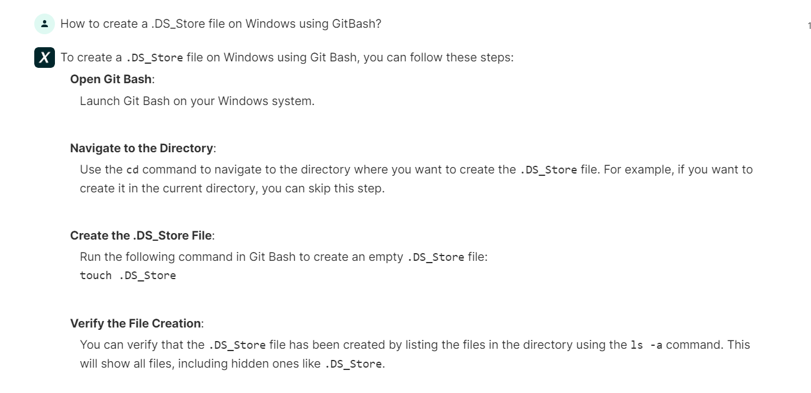

# <Your-Project-Title>

## Description

The motivation for this project is to create a README file for a web application that can be generated by answering a list of questions input by the user. There is also a detailed guide included on how to use or operate this README generator application. I learned how to further expand my knowledge on Node.js and how to use Node.js to generate a README.md file.

## Table of Contents (Optional)

- [Installation](#installation)
- [Usage](#usage)
- [Credits](#credits)
- [License](#license)

## Installation

Follow and answer the prompts on screen.

## Usage

This project's purpose is to generate a Professional README.md file for use on future projects.

To add a screenshot, create an `assets/images` folder in your repository and upload your screenshot to it. Then, using the relative filepath, add it to your README using the following syntax:

    ```md
    
    ```

## Credits

Resources used were:

Zoom recordings of the class, NPM, Xpert AI Learning Assistant, Google search, StackOverflow, a blog, worked with a friend to help me better understand and explain why I was getting certain errors.

Links for resources used:
https://blog.bolajiayodeji.com/how-to-create-an-automated-profile-readme-using-nodejs-and-github-actions
https://zoom.us/rec/play/F9IImjQ6EZU-2NUskW236-xar9HF-pVAeYteIs8Wk529gom_1qRMtOLnOmq-ne6fESdEMjrRO54UXKEB.QCe_mAinDEXQuZox
https://www.google.com/search?q=What+is+the+Tests+section+of+a+README.md+file+supposed+to+be+about&sca_esv=f5d76052eac9eedd&ei=-EWlZpyPM6KfwN4P1ZiIIA&ved=0ahUKEwic68D39ceHAxWiD9AFHVUMAgQQ4dUDCBA&uact=5&oq=What+is+the+Tests+section+of+a+README.md+file+supposed+to+be+about&gs_lp=Egxnd3Mtd2l6LXNlcnAiQldoYXQgaXMgdGhlIFRlc3RzIHNlY3Rpb24gb2YgYSBSRUFETUUubWQgZmlsZSBzdXBwb3NlZCB0byBiZSBhYm91dEipB1AAWJEFcAB4AZABAJgBa6ABwQGqAQMxLjG4AQPIAQD4AQGYAgCgAgCYAwCSBwCgB-cB&sclient=gws-wiz-serp
https://stackoverflow.com/questions/54083539/how-to-create-a-select-drop-down-using-data-from-an-array-of-objects-in-javascri
https://stackoverflow.com/questions/72788530/what-npm-command-creates-a-dist-folder-in-nodejs
https://www.npmjs.com/package/inquirer#question
https://bootcampspot.instructure.com/courses/6643/external_tools/313



## License

The last section of a high-quality README file is the license. This lets other developers know what they can and cannot do with your project. If you need help choosing a license, refer to [https://choosealicense.com/](https://choosealicense.com/).

## Badges


Badges aren't necessary, per se, but they demonstrate street cred. Badges let other developers know that you know what you're doing. Check out the badges hosted by [shields.io](https://shields.io/). You may not understand what they all represent now, but you will in time.

## Features

If your project has a lot of features, list them here.

## How to Contribute

If you created an application or package and would like other developers to contribute it, you can include guidelines for how to do so. The [Contributor Covenant](https://www.contributor-covenant.org/) is an industry standard, but you can always write your own if you'd prefer.

## Tests